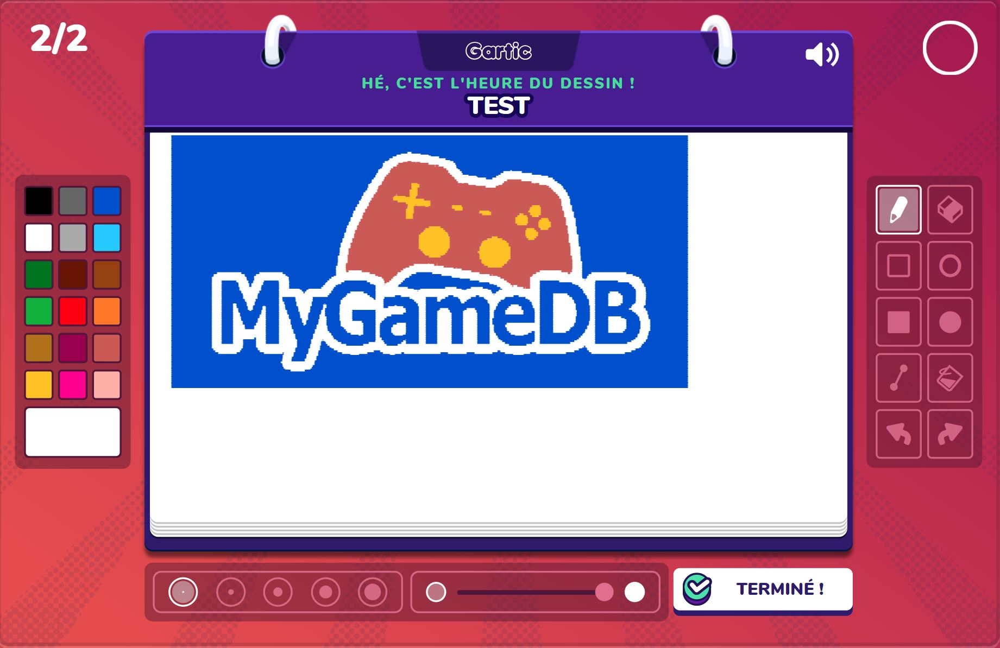
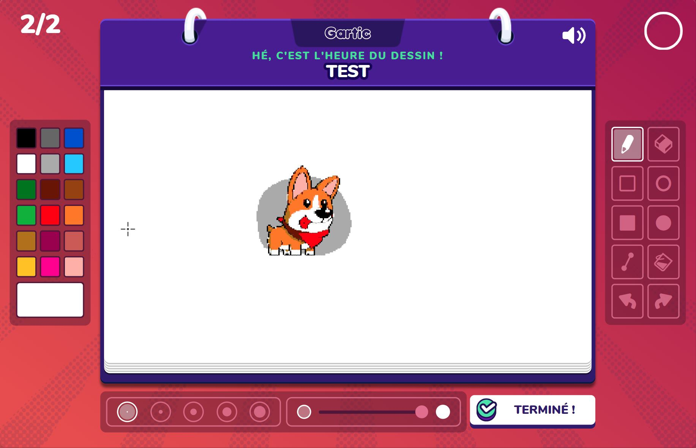
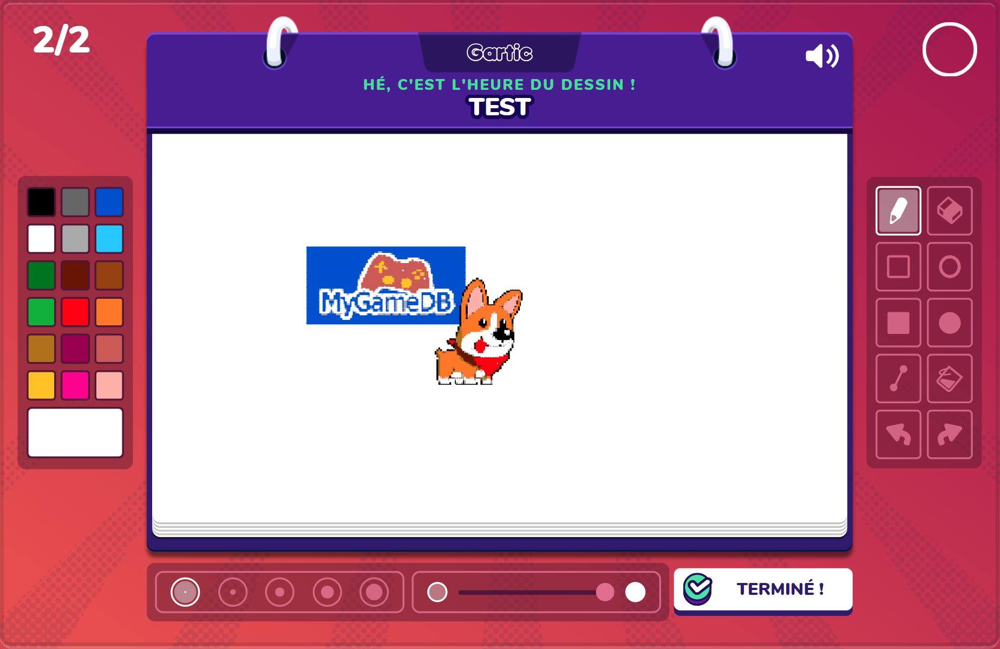

# DrawInKrita

NO LONGER A BOT, NOW A PLUGIN FOR KRITA!

# Installation

- Install [Python 3](https://www.python.org/downloads/)
- Run `pip install -r requirements.txt`
- Run additional tweaking and setup idfk lol

# How to use

To run the plguin, follow this steps:  
- Be sure to have Python 3.x installed
- Run `pip install -r requirements.txt`
- Run `python main.py [-v | --verbose]`
- The next step is still buggy, just export the image and give it the location or paste a URL
- When asking for the first point, just click on the drawing workplan. This point must be the top - left corner where the drawing should start.
- When asking for the second point, click on the drawing workplan. This second point must be the bottom - right corner where the drawing should end.
- Wait for some seconds (the larger and detailed the drawing area is, the longer the duration will be) and the plugin will automatically choose the right colors to draw between the two points you gave.

# Bot support

The plugin have been tested under Linux, but it should also work on Windows 10.  
Since the bot needs to be configured for each screen resolution in order to match the click on colors, the supported resolutions (in pixels) are:
- 2560x1440
- 1920x1080

More resolutions can be added in the file [colors.py](colors.py).

# Examples

- Base picture: 
- Bot drawing: 
- Time: 75 seconds

- Base picture: 
- Bot drawing: 
- Time: 35 seconds

- Note that transparent pictures also works
- Bot drawing: 
- Total time: 48 seconds
